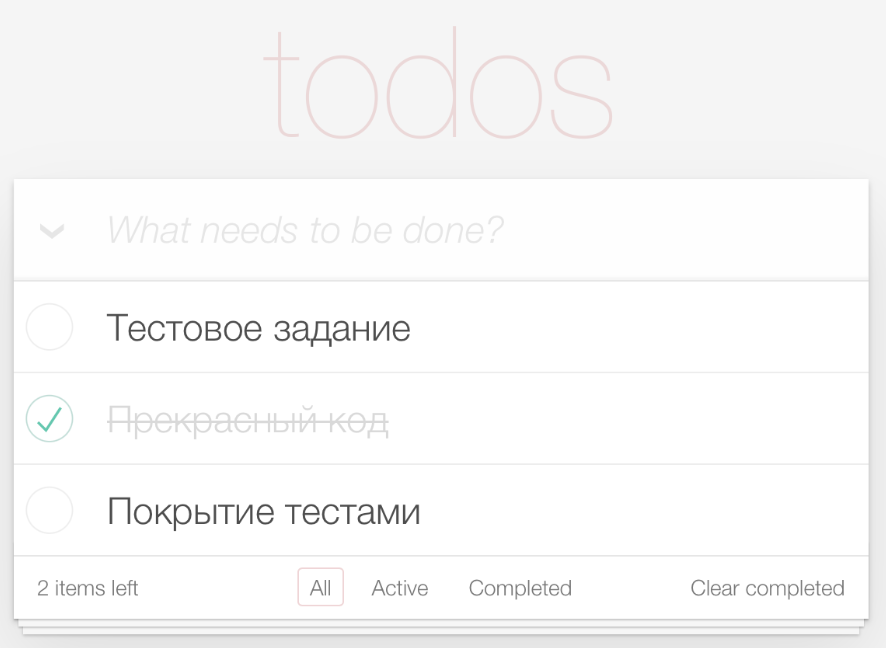

# ToDo App 📝
[](https://github.com/Jarweb01/todos-app/actions/workflows/ci.yml)


Простое ToDo-приложение.

## ✨ Функциональность

- Добавление задач
- Переключение задач как "выполнено / не выполнено"
- Фильтрация задач: все / активные / выполненные
- Очистка выполненных задач
- Счётчик оставшихся задач
- Разделение задач на 3 списка
- Тесты ключевых компонентов

---

## 🛠️ Стек технологий

- [React](https://react.dev/)
- [TypeScript](https://www.typescriptlang.org/)
- [Vite](https://vitejs.dev/)
- [Tailwind CSS](https://tailwindcss.com/)
- [Vitest](https://vitest.dev/) + [@testing-library/react](https://testing-library.com/)

---

## 🚀 Установка и запуск

```bash
# Установить зависимости
npm install

# Запустить проект в режиме разработки
npm run dev

# Запустить тесты
npm run test

# Сборка проекта
npm run build
```
## 🌍 Деплой

Проект доступен по ссылке: [todos-app.vercel.app](https://todo-app-seven-phi-12.vercel.app/)

# Скриншот

